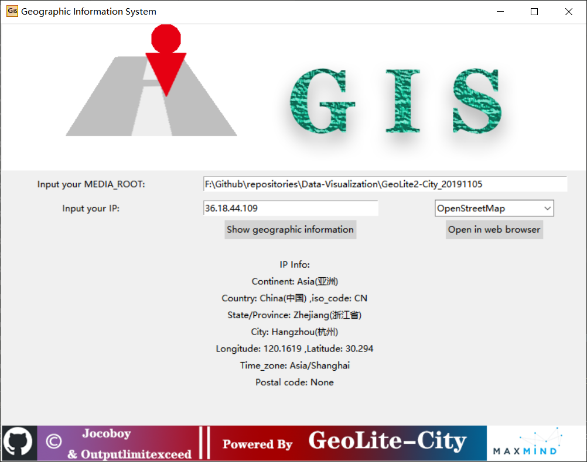
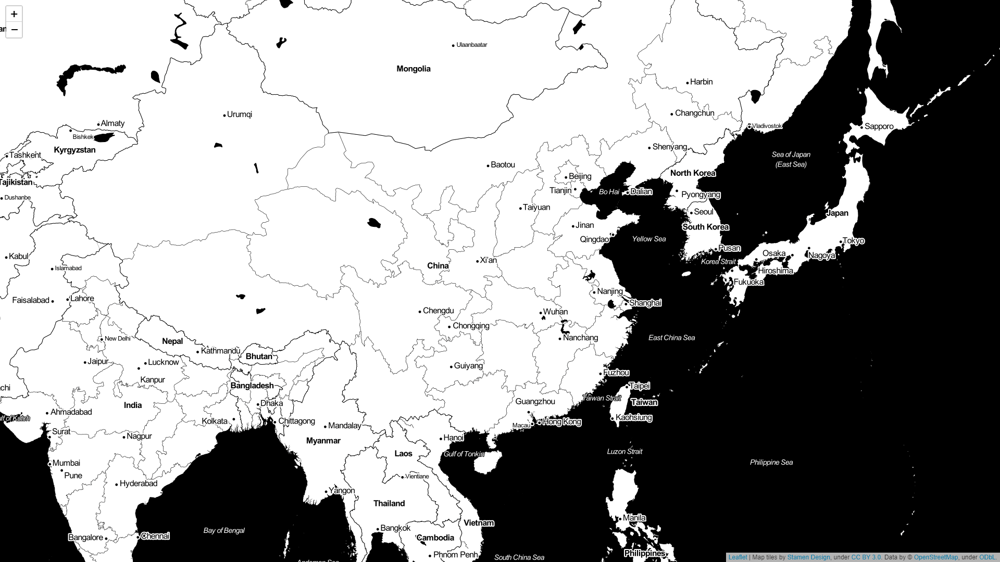

# Geographic Information System (GIS)

A Light system to query map infomation base on IP, yet to be advised.

## :mag:Preview

### Main Window


### Map in Web Browser
### Main Window



## :nut_and_bolt:Dependencies

- Python 3.7
    ```
    pip install folium
    pip install geoip2
    ```
- MaxMind DataBase [GeoLite2-City](https://dev.maxmind.com/geoip/geoip2/geolite2/)

## :pencil:Usage

- MEDIA_ROOT: 
        The root path of the offline database GeoLite2-City.
- IP:
        Since IP is unique worldwide, we establish the mapping relations between IP and Geographic Information.
- MAP_TYPE:
        ``folium`` builds on the mapping strengths of the leaflet.js library. The library has a number of built-in tilesets from ***OpenStreetMap***, ***Stamen Terrain***, ***Stamen Toner***, ***Stamen Watercolor***, ***CartoDB positron***, ***CartoDB dark_matter***, ***Mapbox Bright***, ***Mapbox Control Room***, and supports custom tilesets with [***Mapbox***](https://www.mapbox.com/) or [***Cloudmade***](https://cloudmade.com/) API keys. You can just select one and open in your web browser.

## :octocat:Contributors

[@Jocoboy](https://github.com/Jocoboy)
[@outputlimitexceed](https://github.com/outputlimitexceed)