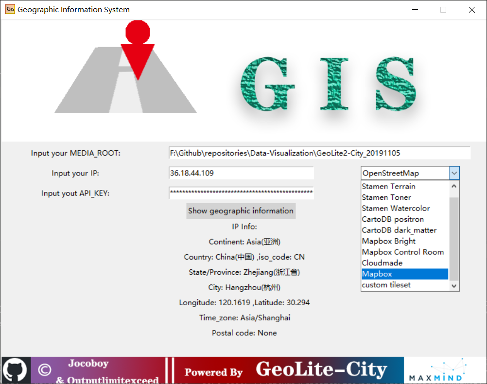
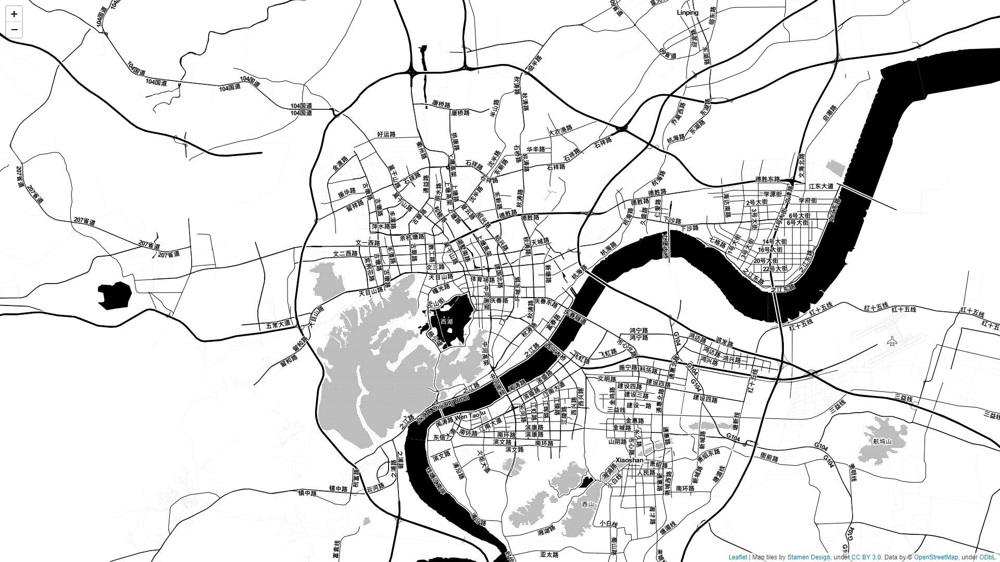

# Geographic Information System (GIS)

A light system to query map information based on IP, yet to be advised.

## :mag:Preview

### Main Window



### Map in Web Browser



## :nut_and_bolt:Dependencies

- Python 3.7
    ```
    pip install folium
    pip install geoip2
    pip install plotly
    ```
    For domestic user, please use pypi mirror ```pip install -i https://pypi.tuna.tsinghua.edu.cn/simple some-package``` instead.
- MaxMind DataBase [GeoLite2-City](https://dev.maxmind.com/geoip/geoip2/geolite2/)

## :pencil:Usage

- MEDIA_ROOT: 
        The root path of the offline database GeoLite2-City.
- IP:
        Since IP is unique worldwide, we establish the mapping relations between IP and Geographic Information.
- MAP_TYPE:
        ``folium`` builds on the mapping strengths of the ``leaflet.js`` library. The library has a number of built-in tilesets from ***OpenStreetMap***, ***Stamen Terrain***, ***Stamen Toner***, ***Stamen Watercolor***, ***CartoDB positron***, ***CartoDB dark_matter***, ***Mapbox Bright***, ***Mapbox Control Room***, and supports custom tilesets with [***Mapbox***](https://www.mapbox.com/) or [***Cloudmade***](https://cloudmade.com/) API keys. You can just select one and open in your web browser.

- API_KEY:
        API keys is a must if you choose custom tilesets with Mapbox or Cloudmade. Here we use ``plotly.graph_objs`` and ``plotly.offline.offline`` to plot local maps if you have passed the mapbox accesstoken. Note that Cloudmade is not available temporarily.

- custom tileset:
        ``folium`` supports passing any ``leaflet.js`` compatible custom tileset. Before you choose a custom tileset, you are supposed to configure ``tiles`` and ``attr``
        ```
        tiles='http://{s}.tiles.yourtiles.com/{z}/{x}/{y}.png', attr='My Data Attribution'
        ```
        at ``Configuration.get_local_map()`` in ``configurations.py``.

## :fish:History Version&&New Feature    

- v1.0, basic functions implemented, including offline query based on IP and major built-in tilesets preview(offline).

- v1.1, based on the current functions, new features added, including online query(Mapbox&Cloudmade) through API_KEY and custom tileset preview(online).

- v1.2, based on the current functions, new features added, including photos and descriptions of 34 provincial capitals of China and 15 cities abroad.

## :octocat:Contributors

[@Jocoboy](https://github.com/Jocoboy)

[@outputlimitexceed](https://github.com/outputlimitexceed)