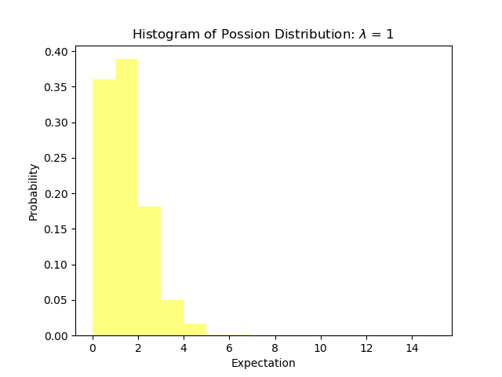
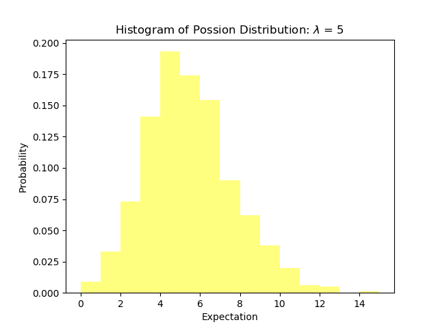
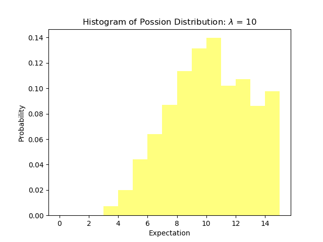
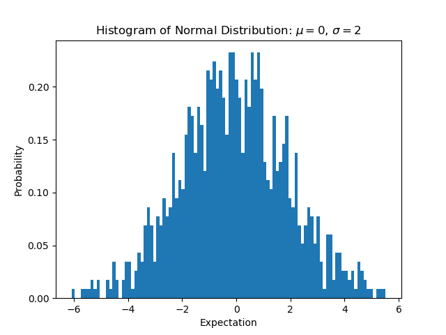
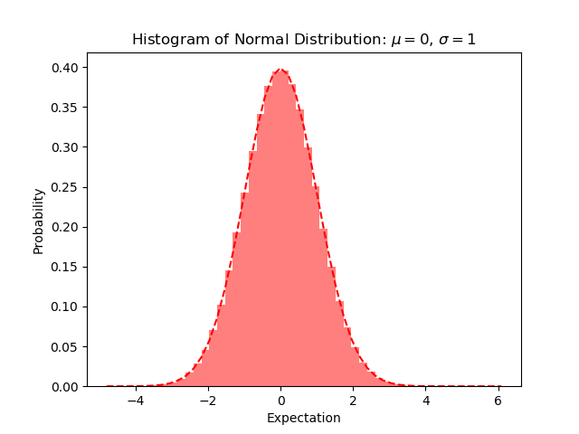

# Data Visualization in Python

## Wordcloud 

## How to get cid

```
Enter 'ctrl+U' to see source page.
Enter 'ctrl+F' to search keyword 'cid'.
```

## Example

[av67358208](https://www.bilibili.com/video/av67358208)

[cid.xml](http://comment.bilibili.com/116788897.xml)


## Statistics 

### Discrete Distribution

#### Possion Distribution

**Probability Mass Function**


For events with an expected separation λ the Poisson distribution f(k; λ) describes the probability of k events occurring within the observed interval λ.






### Continuous Distribution

#### Normal Distribution

**Probability Density Function**


**Cumulative Distribution Function**


**Parameters:**
- **μ** : mean of Normal Distribution —— its modification will lead to curve's horizontal shift
- **σ** : standard deviation of Normal Distribution —— the smaller it is, the more concentrated Normal Distribution will be (the curve will be higher and slimmer).
- **σ²** : variance of Normal Distribution





