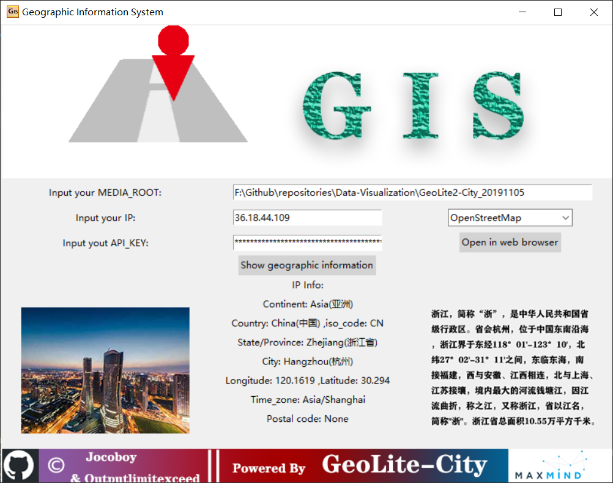
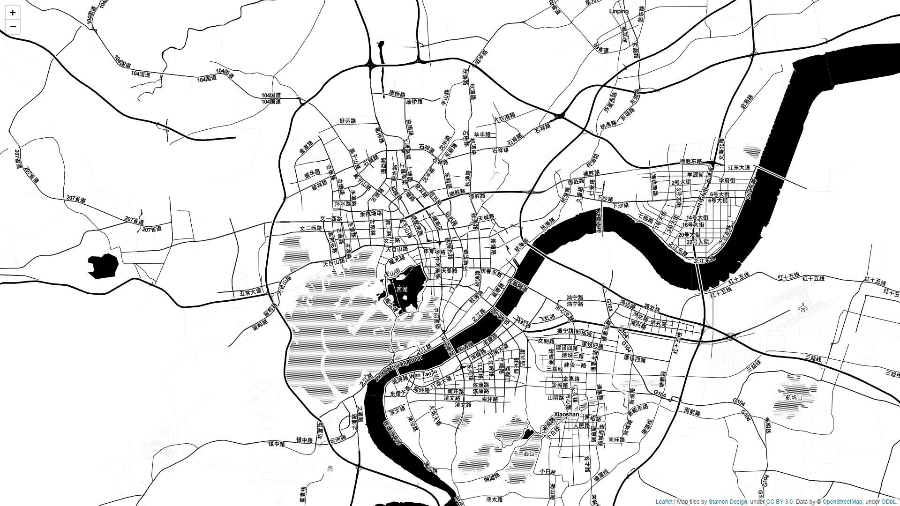

# Geographic Information System (GIS)

一个轻量级的基于IP地址查询地图信息的地理信息系统，有待改进。

## :mag:预览图

### 主界面



### 演示



## :nut_and_bolt:依赖环境

- Python 3.7
    ```
    pip install folium
    pip install geoip2
    pip install plotly
    ```
    对于国内用户, 我们推荐使用pypi镜像 ```pip install -i https://pypi.tuna.tsinghua.edu.cn/simple some-package```。
- MaxMind DataBase [GeoLite2-City](https://dev.maxmind.com/geoip/geoip2/geolite2/)

## :pencil:使用说明

- MEDIA_ROOT: 
        GeoLite2-City.mmdb离线数据库在本机上的根目录。
- IP:
        借由IP的独一无二性，通过IP地址获取所在位置的地理信息。
- MAP_TYPE:
        ``folium``模块建立在``leaflet.js``库强大的地图渲染功能之上。库中含有大量的离线内置地图模型，例如：***OpenStreetMap***, ***Stamen Terrain***, ***Stamen Toner***, ***Stamen Watercolor***, ***CartoDB positron***, ***CartoDB dark_matter***, ***Mapbox Bright***, ***Mapbox Control Room***, 并且支持通过 [***Mapbox***](https://www.mapbox.com/) 或 [***Cloudmade***](https://cloudmade.com/) 的API密钥在线查看地图。以上供用户自主选择。

- API_KEY:
        如果你选择通过``Mapbox``或者``Cloudmade``自主定制用于个性化查询的地图，那么你需要提供它们对应的API密钥。如果你已经通过了Mapbox的访问令牌，我们将借助 ``plotly.graph_objs`` 和 ``plotly.offline.offline`` 模块帮您呈现效果。值得注意的是，cloudmade的功能尚待实现。

- 定制地图:
        ``folium``模块支持任何与``leaflet.js``库兼容的定制地图。 在你选择定制地图之前，你需要在 ``configurations.py``模块中配置``Configuration.get_local_map()``内的``tiles`` 和 ``attr``
        ```
        tiles='http://{s}.tiles.yourtiles.com/{z}/{x}/{y}.png', attr='My Data Attribution'
        ```
## :fish:历史版本&&新特性    

- v1.0版本，实现了基本的IP映射地理信息的离线查询功能，并实现了主要离线内置地图的预览功能。

- v1.1版本，在现有功能基础之上，追加Mapbox和Cloudmade在线地图查询功能，用户可通过API密钥在线查看地图；同时添加了个性化地图定制模板，供用户自主选择。

- v1.2版本，在现有功能基础之上，追加中国34个省会城市预览图以及预览信息；同时追击15个国外城市预览图以及预览信息。

## :octocat:贡献者

[@Jocoboy](https://github.com/Jocoboy)

[@outputlimitexceed](https://github.com/outputlimitexceed)

|贡献者|贡献内容|贡献内容|贡献内容|贡献内容|贡献内容|贡献内容|贡献内容
|:---|:---:|:---:|:---:|:---:|:---:|:---:|:---:|
|嵇康钧|软件构思&逻辑整理|环境配置|主程设计|UI实现|英文文档编写|文档校订|新特性追加      
|任建城|画布设计&图标设计|图片资源搜集|软件测试|UI设计|中文文档编写|图片批处理|新特性追加


